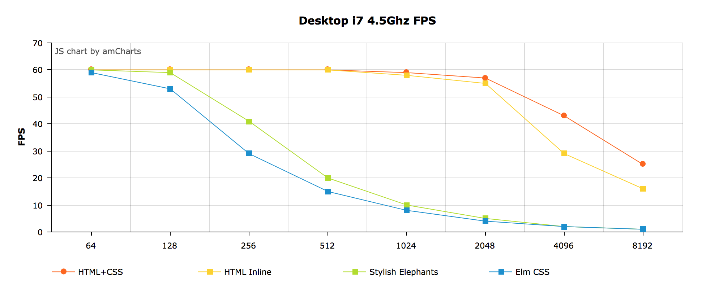

You can open the test app and try it on your device:

* [Elm 0.18](https://rawgit.com/webbhuset/test-elm-performance/master/index.html)
* [Elm 0.19](https://rawgit.com/webbhuset/test-elm-performance/master/0.19/index.html)

Just choose your prefered settings and hit "Run Test".

## What is this?

This is a simple, non-scientific test of the render performance of the Elm Virtual DOM. I
created this to get a better understanding on how the Virtual DOM works and what affects
the rendering performance.

Four common approaches of working with style / layout are implemented and can be compared:

* HTML with CSS (only CSS classes are handled by Elm)
* HTML with Inline Style (all style is handled by Elm)
* [Stylish Elephants](http://package.elm-lang.org/packages/mdgriffith/stylish-elephants/6.0.2) 6.0.2
* [elm-css](http://package.elm-lang.org/packages/rtfeldman/elm-css/14.0.0) 14.0.0

One UI component (an accordion) is implemented with each of the above techniques and can be compared.
The rendering times are printed to the console using [console.time](https://developer.mozilla.org/en-US/docs/Web/API/Console/time) and [console.timeEnd](https://developer.mozilla.org/en-US/docs/Web/API/Console/timeEnd). This is achieved by patching the virtual-dom package. Three metrics are logged:

1. **view**: The time of the view function in the Elm program.
2. **diff**: The time it takes to compare the generated tree with previous VDOM tree and generating a patch (the Reconciliation algorithm).
3. **apply**: This is the time it takes to apply the changes to the "real" DOM.

## Some Test Results

### Small changes to the DOM

For example when you toggle someting on the page. In this case I opened the first accordion.

|             | HTML-CSS | HTML Inline |  SE   | elm-css |
| ----------- | -------- | ----------- | ----- | ------- |
| View        |      7.2 |        18.1 |   400 |     730 |
| Diff        |      4.3 |        10.8 |    27 |     6.5 |
| Apply       |    < 1.0 |       < 1.0 | < 1.0 |   < 1.0 |
| Node Count* |     3120 |        3120 |  6195 |    3121 |

 *DOM Node Count using `document.querySelectorAll('*').length`

* Here you can se that the view function of the program is the largest part of rendering.
* Even though the html-inline approach has the same html elements as html-css, it takes more time on both *view* and *diff* since it also has to handle all the style attributes.
* Stylish Elephants does a lot more work for you than just generating a Virtual Dom tree, so this comparisation is quite unfair. But on the other hand, this is a performance test.
* Using [Html.Lazy](http://package.elm-lang.org/packages/elm-lang/html/2.0.0/Html-Lazy) (or [Element.Lazy](http://package.elm-lang.org/packages/mdgriffith/stylish-elephants/6.0.2/Element-Lazy) or [Html.Styled.Lazy](http://package.elm-lang.org/packages/rtfeldman/elm-css/14.0.0/Html-Styled-Lazy)) will reduce the *view* and *diff* step.
* Since just one element has to be changed, the apply step is below 1ms and does not have any practical impact on the performance.

### Large change to the DOM

This could be when switching page in your application. I switched between implementations to emulate this.

|             | HTML-CSS | HTML Inline |  SE   | elm-css |
| ----------- | -------- | ----------- | ----- | ------- |
| View        |      6.5 |        22.7 |   400 |     750 |
| Diff        |      1.2 |         0.8 |   0.5 |     0.1 |
| Apply       |      130 |         270 |   170 |     125 |

* The same amount of Virtual DOM is generated in this test so the time on the view function is more or less the same as in the previous test.
* Since `Html.Keyed` is used around the accordion wrapper the diffing will bail out early and just replace the whole thing. This is why you see much lower times on the diffing step compared to the previous example.
* Applying the patch to the "real" DOM takes more time here since many nodes has to be deleted and created.
* You can see that the html-inline implementation takes more time to apply since it also has to handle a lot of attributes on each node.

### Layout and Paint

When a browser renders the page there is a lot more happening than just diffing and applying virtual DOM.
A fair amount of time is also spent on calculating layout and painting. Garbage Collection cycles can also affect the rendering performance.

In this test I opened first accordion and measured the time of each part in the rendering process.

With 1024 Accordions

|             | HTML-CSS | HTML Inline |  SE   | elm-css |
| ----------- | -------- | ----------- | ----- | ------- |
| View        |       27 |          33 |   670 |     800 |
| Diff        |        7 |          10 |    31 |     7.5 |
| Apply       |    < 1.0 |       < 1.0 | < 1.0 |   < 1.0 |
| Layout      |       45 |          45 |   150 |      95 |
| Paint       |      3.5 |         3.5 |    25 |     5.9 |

### Animation Frame FPS vs Size

If you hit the "Run Test" button the app will call `requestAnimationFrame` 30 times and open an accordion on each frame.
This way the whole rendering cycle is taken into account since `requestAnimationFrame` will queue each update after every render.

Here are some results from different devices showing how FPS decreases as the accordion count increases. (Click the charts to open an interactive version)

#### Desktop i7 4.5Ghz

#### Samsung Galaxy S7

## Conclusion

In reality the numbers would probably look different. The html-css implementation is very naive and I think the test it is somewhat unfair to stylish elephants. Maybe I will try to make a more realistic example some day.

You'd probably want to use [Element.Lazy](http://package.elm-lang.org/packages/mdgriffith/stylish-elephants/6.0.2/Element-Lazy) if you are building a larger project using stylish elephants or [Html.Styled.Lazy](http://package.elm-lang.org/packages/rtfeldman/elm-css/14.0.0/Html-Styled-Lazy) using elm-css. Especially if you are targeting low end devices.

 
